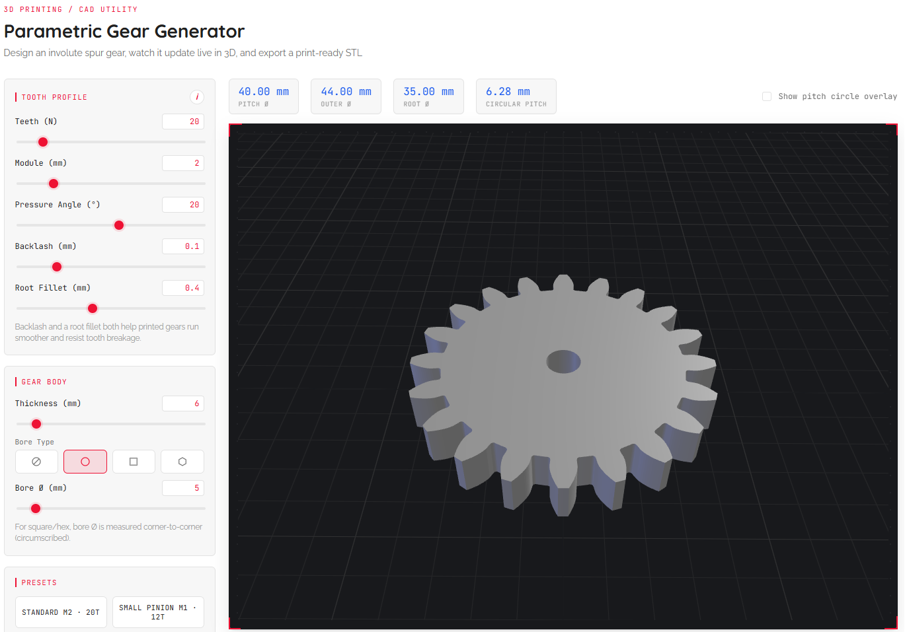

# Parametric Gear Generator

Design an involute spur gear in the browser, preview it in 3D, and export a print-ready STL. Everything runs client-side.

**Live**: https://rschwa6308.github.io/Gear-Generator/ 

Mostly vibe-coded with the help of Claude Sonnet v5.

## Parameters

| Field | Meaning |
|---|---|
| Teeth (N) | Tooth count |
| Module | Tooth size in mm (`pitch diameter = module × teeth`) |
| Pressure Angle | Standard is 20° |
| Thickness | Gear height along its axis |
| Bore Ø | Center shaft hole |
| Backlash | Shaves material off both flanks so mating gears don't bind |
| Root Fillet | Rounds the tooth root for print strength |

Gear configurations are encoded in the URL query string, so any setup is a shareable link.

